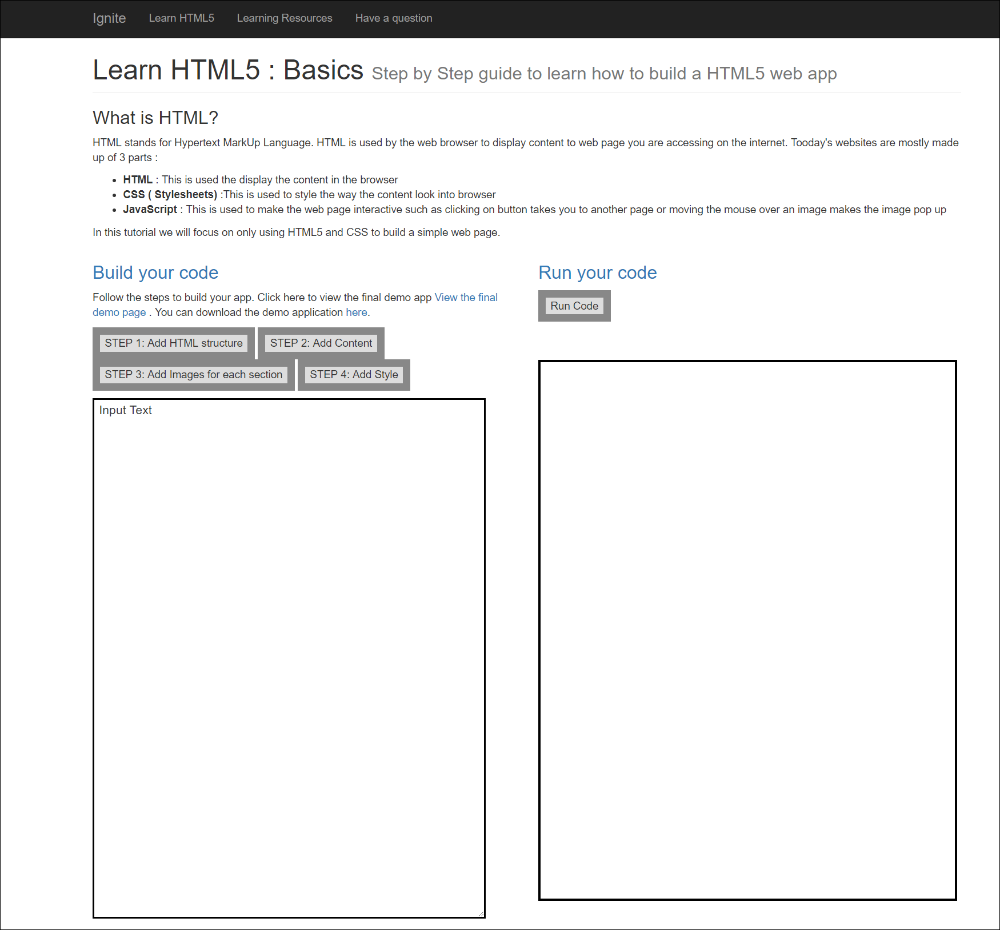

# Learn HTML5 : Basics Step by Step guide to learn how to build a HTML5 web app

## What is HTML?
HTML stands for Hypertext MarkUp Language. HTML is used by the web browser to display content to web page you are accessing on the internet. Tooday's websites are mostly made up of 3 parts :

- HTML : This is used the display the content in the browser
- CSS ( Stylesheets) :This is used to style the way the content look into browser
- JavaScript : This is used to make the web page interactive such as clicking on button takes you to another page or moving the mouse over an image makes the image pop up
- In this tutorial we will focus on only using HTML5 and CSS to build a simple web page.

## How to to use this code 
- Create a web app on local IIS web server or [Azure app service](https://docs.microsoft.com/en-us/azure/app-service).
- Download the code from this repository and deploy it within you web app 
- Browse the app 

- Under **Build your code**  follow each step from  Step 1 to Step 4 for first time users to use sample code. Clicking on these button generates the code for you. If you are faimilar with HTML , write your code in the Text area under **Build your code** section 
- Click on **Run code** button to view the result of the custom code or sample code 

